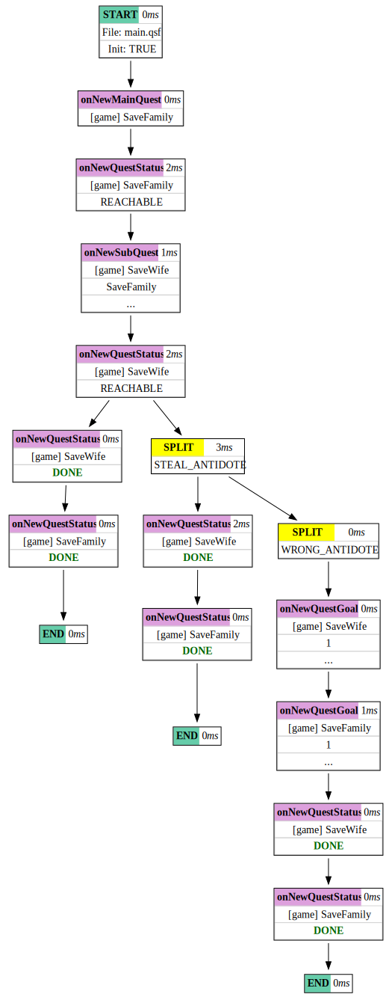

# 2. Goals & Subquests

In this tutorial, we’ll introduce **subquests** and **multiple quest goals**.

All files used in this tutorial are available in the `docs/code` directory.

## Table of Contents

1. [Before We Start](#before-we-start)  
2. [Quest Description](#quest-description)  
3. [Quest Analysis](#quest-analysis)  
4. [Main QSF](#main-qsf)  
5. [First Iteration](#first-iteration)  
    1. [Types & Objects](#types--objects)  
    2. [Relations](#relations)  
    3. [Actions](#actions)  
    4. [Main Quest](#main-quest)
6. [Subquest](#subquest)  
7. [Alternative Timeline](#alternative-timeline)  
8. [Event Splitting](#event-splitting)  
9. [Even More Details](#even-more-details)  
10. [Next](#next)  

## Before We Start

Make sure you have completed the [previous tutorial](01-getting-started.md).

## Quest Description

In this tutorial, we’ll recreate a more complex quest from the  [paper](https://www.researchgate.net/publication/286454232_Hierarchical_Generation_of_Dynamic_and_Nondeterministic_Quests_in_Games):
```
Imagine a zombie‑survival game.
John, the main character, must save his family and protect his house.
His wife, Anne, was bitten by a zombie in a nearby forest.
John can seek an antidote at either the hospital or the local market.
If he fails, he’ll be forced to kill Anne and flee.
```
Later we’ll add extra details, like locations, characters, and branching outcomes.

## Quest Analysis

This quest is a great opportunity to introduce subquests and multiple goals in LibMozok. A single quest can have multiple alternative goals, but only one goal can be active at a time, and only one (if any) will be achieved. Goals are "well-ordered," starting from the primary goal, followed by the first alternative, second alternative, and so on.

In our case:

- **Goal 1 (Primary)**: Anne is healthy **and** the house is protected.  
- **Goal 2 (Alternative)**: John escapes.

We’ll make “saving Anne” as a separate subquest with two goals:

- **Goal 1 (Primary)**: Anne is healthy.  
- **Goal 2 (Alternative)**: Anne is dead.

When a quest activates, the planner find the first achievable goal. If that goal becomes unreachable during play, it automatically switches to the next alternative - and **never switches back**, even if the original goal becomes achievable again.

## Main QSF

For this tutorial, we only need one quest world. Let's create a directory to store all the files for this tutorial. We'll assume it's `<tut>/02/`. Inside that directory, create a `main.qsf` file with the following content:

```nim
# main.qsf
version 1 0
script main

worlds: 
    game
projects:
    [game] save_family.quest
init:
    [game] Init()
```

## First Iteration

We’ll start by defining the main quest. 

Create `save_family.quest`:
```nim
# save_family.quest
version 1 0
project save_family

# ...
# (we’ll fill this in below)
```

### Types & Objects

What types and objects do we need? In LibMozok, objects don't have internal state, so many world details will be modeled using relations. 

Add the following lines to `save_family.quest`:
```nim
type Place
    type Protectable : Place

type Locatable
    type Item : Locatable
    type Character : Locatable
        type Player : Character

object john_ : Player
object anne_ : Character

object home_ : Protectable
object forest_ : Place
```

Here tabs indicate subtyping.

### Relations

Define the following relations (in `save_family.quest`):
```nim
# A locatable object {1} is at place {2}.
rel At(Locatable, Place)

# A character is healthy.
rel Healthy(Character)

# A character is infected.
rel Infected(Character)

# A safe place.
rel Safe(Place)

# A protectable place is protected.
rel Protected(Protectable)

# A path exists from place {1} to place {2}.
rel Path(Place, Place)

rel Escaped(Character)
```

This is a good opportunity to introduce **relation lists**. A relation list is basically a macro command, with syntax very similar to an action. You can use relation lists to define reusable sets of relations. In our case, we want to define `Path2(a, b)` - a two way path:
```nim
rlist Path2:
    a : Place
    b : Place
    Path(a, b)
    Path(b, a)
```

### Actions

First, lets define the `Init()` action:
```nim
action Init:
    pre # none
    rem # none
    add Path2(forest_, home_)
        Safe(home_)
        At(john_, forest_)
        At(anne_, forest_)
        Healthy(john_)
        Infected(anne_)
```
Note the use of `Path2()` here.

Next, actions to achieve the main quest’s primary goal:
```nim
action TakeInfected:
    player : Player
    character : Character
    from : Place
    to : Place
    pre Healthy(player)
        Infected(character)
        At(player, from)
        At(character, from)
        Path(from, to)
    rem At(player, from)
        At(character, from)
    add At(player, to)
        At(character, to)


action SaveInfected:
    player : Player
    character : Character
    safe_place : Place
    pre Healthy(player)
        Infected(character)
        At(player, safe_place)
        At(character, safe_place)
        Safe(safe_place)
    rem Infected(character)
    add Healthy(character)


action Protect:
    player : Player
    place : Protectable
    pre Healthy(player)
        At(player, place)
    rem # none
    add Protected(place)
```

### Main Quest

The main quest with two goals:
```nim
main_quest SaveFamily:
    preconditions:
        # none
    goal:
        Healthy(anne_)
        Protected(home_)
    goal:
        Escaped(john_)
    actions:
        TakeInfected
        SaveInfected
        Protect
    objects:
        john_
        anne_
        forest_
        home_
    subquests:
        # none
```

Run the simulation:
```
<mozok> main.qsf -v -P OK
() INFO: =============== NEW TIMELINE ===============
() INFO: EVENT: onNewMainQuest [game] SaveFamily
() INFO: EVENT: onNewQuestStatus [game] SaveFamily REACHABLE
() INFO: EVENT: onNewQuestPlan [game] SaveFamily
() INFO:        New plan accepted for [game] SaveFamily:
() INFO:        - TakeInfected
() INFO:        - SaveInfected
() INFO:        - Protect
() INFO: pushAction [game] TakeInfected(john_,anne_,forest_,home_)
() INFO: pushAction [game] SaveInfected(john_,anne_,home_)
() INFO: EVENT: onNewQuestState [game] SaveFamily
() INFO: EVENT: onNewQuestPlan [game] SaveFamily
() INFO: EVENT: onNewQuestState [game] SaveFamily
() INFO: EVENT: onNewQuestPlan [game] SaveFamily
() INFO: pushAction [game] Protect(john_,home_)
() INFO: EVENT: onNewQuestState [game] SaveFamily
() INFO: EVENT: onNewQuestStatus [game] SaveFamily DONE
() INFO: EVENT: onNewQuestPlan [game] SaveFamily
() INFO: All quest expectations are met.
OK
```

As you can see, these three actions complete the main quest:
```nim
TakeInfected(john_,anne_,forest_,home_)
SaveInfected(john_,anne_,home_)
Protect(john_,home_)
```

## Subquest

Next, subquest about John’s effort to save Anne.

1. Add new types and objects:
```nim
# Add this to types:
type Antidote : Item

# Add this to the section where we define objects:
object hospital_ : Place
object antidote_ : Antidote
```

2. Add relations:
```nim
# Character {1} has item {2}.
rel Has(Character, Item)

rel Dead(Character)
```

3. Extend `Init()` action:
```nim
# at the end of Init():
At(antidote_, hospital_)
Path2(hospital_, home_)
```

4. To complete the `SaveWife` subquest we need these actions:
```nim
action GoTo:
    player : Player
    from : Place
    to : Place
    pre Healthy(player)
        At(player, from)
    rem At(player, from)
    add At(player, to)


action Take:
    player : Player
    item : Item
    place : Place
    pre At(player, place)
        At(item, place)
    rem At(item, place)
    add Has(player, item)


action Heal:
    player : Player
    antidote : Antidote
    place : Place
    character : Character
    pre Has(player, antidote)
        Infected(character)
        At(player, place)
        At(character, place)
    rem Has(player, antidote)
        Infected(character)
    add Healthy(character)
```

5. Define `SaveWife` subquest:
```nim
quest SaveWife:
    preconditions:
        At(anne_, home_)
        At(john_, home_)
        Infected(anne_)
    goal:
        Healthy(anne_)
    goal:
        Dead(anne_)
    actions:
        GoTo
        Take
        Heal
    objects:
        john_
        anne_
        forest_
        home_
        hospital_
        antidote_
    subquests:
        # none
```

6. Link it in the main quest:
```nim
main_quest SaveFamily:
    ...
    subquests:
        SaveWife
```

At this point, if we try to run the Mozok app, the output will be the same. This is because subquests are only activated when they are found to be associated with an `N/A` (Non Applicable) action that is the next action from an already activated quest's plan.

"Associated" means that the quest is listed as a subquest, the action's preconditions are a subset of the subquest's preconditions, and the `add` section relations are a subset of some `goal` statements in the subquest. If this is the case, the subquest is activated with this goal as the active goal.

Think of `N/A` as compound actions that cannot be applied directly in the game, but for which there exists a sequence of applicable actions that will produce the same effect and will also complete the associated activated subquest.

Let's modify the `SaveInfected` action to make it `N/A`:
```nim
action N/A SaveInfected:
```

If we run the mozok app, we'll get an error:
```
<mozok> main.qsf -v -P OK
() INFO: =============== NEW TIMELINE ===============
() INFO: EVENT: onNewMainQuest [game] SaveFamily
() INFO: EVENT: onNewQuestStatus [game] SaveFamily REACHABLE
() INFO: EVENT: onNewQuestPlan [game] SaveFamily
() INFO:        New plan accepted for [game] SaveFamily:
() INFO:        - TakeInfected
() INFO:        - SaveInfected
() INFO:        - Protect
() INFO: pushAction [game] TakeInfected(john_,anne_,forest_,home_)
() INFO: EVENT: onNewQuestState [game] SaveFamily
() INFO: EVENT: onNewQuestPlan [game] SaveFamily
() INFO: EVENT: onNewSubQuest [game] SaveWife SaveFamily 0
() INFO: EVENT: onNewQuestStatus [game] SaveWife REACHABLE
() INFO: EVENT: onNewQuestPlan [game] SaveWife
() INFO:        New plan accepted for [game] SaveWife:
() INFO:        - GoTo
() INFO:        - Take
() INFO:        - GoTo
() INFO:        - Heal
() INFO: pushAction [game] GoTo(john_,home_,hospital_)
() INFO: pushAction [game] Take(john_,antidote_,hospital_)
() INFO: EVENT: onNewQuestState [game] SaveFamily
() INFO: EVENT: onNewQuestState [game] SaveWife
() INFO: EVENT: onNewQuestStatus [game] SaveFamily UNREACHABLE
() INFO: EVENT: onNewQuestGoal [game] SaveFamily 1 0
() INFO: EVENT: onNewQuestPlan [game] SaveFamily
() INFO:        New plan accepted for [game] SaveFamily:
() INFO: EVENT: onNewQuestPlan [game] SaveWife
() INFO: EVENT: onNewQuestState [game] SaveWife
() INFO: EVENT: onNewQuestPlan [game] SaveWife
() INFO: Quest `game.SaveFamily` is unreachable (but expected to be DONE).
() ERROR: Oops! error has been occured during the simulation.
```

As you can see, as expected, the main quest was activated and the initial plan was accepted. After the `TakeInfected` action, the next action is `SaveInfected`, which is an `N/A` action, so a new subquest `SaveWife` was activated and a plan was found.

However, after the `GoTo(john_,home_,hospital_)` action, the main quest became `UNREACHABLE`. A quest becomes `UNREACHABLE` when no goal can be achieved from the current state using the quest's defined objects and actions.

We forgot to add `GoTo` to the actions: section of the `SaveFamily` quest. So, after John goes from home to the hospital, from the point of view of the `SaveFamily` quest, there's no way to return (using only the allowed actions and objects).

Let's add `GoTo` to the `actions:` section of `SaveFamily`, add `hospital_` to the `objects:` section, and rerun the Mozok app:
```
<mozok> main.qsf -v -P OK
() INFO: =============== NEW TIMELINE ===============
() INFO: EVENT: onNewMainQuest [game] SaveFamily
() INFO: EVENT: onNewQuestStatus [game] SaveFamily REACHABLE
() INFO: EVENT: onNewQuestPlan [game] SaveFamily
() INFO:        New plan accepted for [game] SaveFamily:
() INFO:        - TakeInfected
() INFO:        - Protect
() INFO:        - SaveInfected
() INFO: pushAction [game] TakeInfected(john_,anne_,forest_,home_)
() INFO: pushAction [game] Protect(john_,home_)
() INFO: EVENT: onNewQuestState [game] SaveFamily
() INFO: EVENT: onNewQuestPlan [game] SaveFamily
() INFO: EVENT: onNewSubQuest [game] SaveWife SaveFamily 0
() INFO: EVENT: onNewQuestStatus [game] SaveWife REACHABLE
() INFO: EVENT: onNewQuestPlan [game] SaveWife
() INFO:        New plan accepted for [game] SaveWife:
() INFO:        - GoTo
() INFO:        - Take
() INFO:        - GoTo
() INFO:        - Heal
() INFO: EVENT: onNewQuestState [game] SaveFamily
() INFO: EVENT: onNewQuestState [game] SaveWife
() INFO: EVENT: onNewQuestPlan [game] SaveFamily
() INFO: EVENT: onNewQuestPlan [game] SaveWife
() INFO: pushAction [game] GoTo(john_,home_,hospital_)
() INFO: pushAction [game] Take(john_,antidote_,hospital_)
() INFO: EVENT: onNewQuestState [game] SaveFamily
() INFO: EVENT: onNewQuestState [game] SaveWife
() INFO: EVENT: onNewQuestPlan [game] SaveFamily
() INFO: EVENT: onNewQuestPlan [game] SaveWife
() INFO: EVENT: onNewQuestState [game] SaveFamily
() INFO: EVENT: onNewQuestState [game] SaveWife
() INFO: EVENT: onNewQuestPlan [game] SaveFamily
() INFO: EVENT: onNewQuestPlan [game] SaveWife
() INFO: pushAction [game] GoTo(john_,hospital_,home_)
() INFO: pushAction [game] Heal(john_,antidote_,home_,anne_)
() INFO: EVENT: onNewQuestState [game] SaveFamily
() INFO: EVENT: onNewQuestState [game] SaveWife
() INFO: EVENT: onNewQuestPlan [game] SaveFamily
() INFO: EVENT: onNewQuestPlan [game] SaveWife
() INFO: EVENT: onNewQuestState [game] SaveFamily
() INFO: EVENT: onNewQuestState [game] SaveWife
() INFO: EVENT: onNewQuestStatus [game] SaveFamily DONE
() INFO: EVENT: onNewQuestPlan [game] SaveFamily
() INFO: EVENT: onNewQuestStatus [game] SaveWife DONE
() INFO: EVENT: onNewQuestPlan [game] SaveWife
() INFO: All quest expectations are met.
OK
```

Great! The subquest was activated, and through a series of actions, the wife was healed.

One thing we notice here is that the Protect action can be used before Anne is healed. We leave it to the reader to figure out how to modify the code to ensure that Protect() is only called when Anne is healthy. If you manage to do that and rerun the Mozok app, you'll get something like this:
```
...
() INFO: skip N/A action [game] SaveInfected(john_,anne_,home_)
() INFO: pushAction [game] Protect(john_,anne_,home_)
...
```

As you can see, `SaveInfected` was skipped by the simulation code, but that’s okay because, at this point, we have already completed the `SaveWife` subquest, which has an effect compatible with applying `SaveInfected`.

## Alternative Timeline

Let’s simulate a timeline where the antidote is stolen as John arrives at the hospital.

1. First, in the `save_family.quest` add these:
```nim
# ...
object thief_ : Character
object old_man_ : Character
object market_ : Place 
object antidote_2_ : Antidote
# ...
# add this to the Init() action:
    Path2(hospital_, market_)
    Path2(home_, market_)
    At(old_man_, market_)
    Has(old_man_, antidote_2_)
# ...
action StealItem:
    character : Character
    item : Item
    place : Place
    pre At(item, place)
    rem At(item, place)
    add Has(character, item)
```

2. Then, add at the end of the `main.qsf`:
```nim
onAction [game] GoTo(john_, home_, hospital_):
SPLIT STEAL_ANTIDOTE:
    push [game] StealItem(thief_, antidote_, hospital_)
```

This is an event handler and is only relevant to the mozok app. This text will be ignored by LibMozok when integrated into a game. It instructs the mozok app to watch for the `onAction` event and, when it occurs, to "split" the timeline into two by "applying and not applying" the block of commands (in our case, `push [game] StealItem(..)`). Essentially, this allows us to simulate different random events that can change how the player will play the game.

If we run the mozok app, we should see something like this:
```
...
(1/1) INFO: -=> Apply split block `STEAL_ANTIDOTE`.
(1/1) INFO: pushAction [game] StealItem(thief_,antidote_,hospital_)
...
(1/1) INFO: EVENT: onNewQuestStatus [game] SaveWife UNREACHABLE
...
```

There is a second antidote at the market, and we need to add an action to buy it:
```nim
action BuyItem:
    player : Player
    character : Character
    item : Item
    place : Place
    pre At(player, place)
        At(character, place)
        Has(character, item)
    rem Has(character, item)
    add Has(player, item)

```

Don’t forget to modify the `objects:` and `actions:` sections of the `SaveWife` and `SaveFamily` quests:
```nim
# SaveWife
    actions:
        GoTo
        Take
        Heal
        BuyItem
    objects:
        john_
        anne_
        old_man_
        forest_
        home_
        hospital_
        market_
        antidote_
        antidote_2_

# ...

# SaveFamily
    actions:
        TakeInfected
        SaveInfected
        Protect
        GoTo
    objects:
        john_
        anne_
        forest_
        home_
        hospital_
        market_

```

Now rerun the mozok app, and you should see the second timeline and `OK` text message at the end.

## Even More Details

We invite the reader to further modify the .quest and .qsf files to include the situation where the old man has the wrong antidote, and to simulate all other goals (adding actions like SwitchItem, Kill, etc.).

You can find the solutions in `code/02-goals-and-subquests/res/`.

The resulting simulation tree with three timelines:

<picture>

</picture>

<hr>

## Next

**Next Tutorial:** [Integration](03-integration.md)
