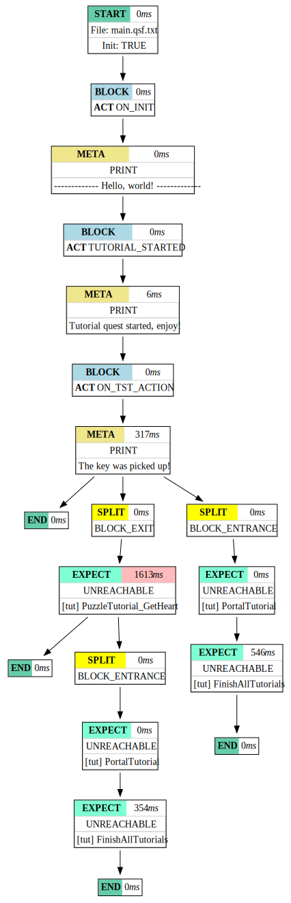

# Quest Debugging Tool

In games where quests can follow many different paths with multiple  possible goals, it can become very time-consuming to manually test all the crucial actions a player might take, measure how long the planner takes to find solutions, or identify which quests might become unreachable. This tool helps automate that process. In the spirit of this library, it allows developers to focus more on delivering an engaging non-linear gameplay experience.  

With the `mozok` debugging tool, you can:
- Simulate all possible story branches.
- Test the expected quests solvability of each timeline.
- Detect if the planner takes too long to find a solution.
- (In future) Visually see the decision tree and problem areas.
- Interact with the model during the simulation.
- And more.

## Quick Start

1. Make sure you've built the library, run `cmake --install ` and have `mozok` (`mozok.exe`) available in `[repo]/install/bin/` (see the [Installation](../README.md#installation) section from the [README.md](../README.md)).
2. (Optional) Add `[repo]install/bin/` to your system `PATH`.
3. View the available options and usage information:
```
mozok -h
```
4. Run the debugger with your main script (e.g., `main_script.qsf`):
```
mozok main_script.qsf
```
5. To generate a simulation graph, see the next section.

## Generating Simulation Graph

### Prerequisites

1. Ensure you’ve built and installed the library, and have `mozok` in `[repo]/install/bin/`.
2. Download and install [`Graphviz`](https://graphviz.org/).
3. (Optional) Add both `[repo]/install/bin/` and Graphviz's `bin` directory to your system `PATH`.

### Graph Generation Steps

1. Generate a `.gv` file representing the simulation graph:
```
mozok script.qsf -g simulation.gv
```

2. If you want to include other additional information, please read how to use visual flags option:
```
mozok -h -f
```

3. Convert the `.gv` file to a visual format like PDF or SVG using Graphviz:
```
dot .\simulation.gv -O -Tpdf
```

4. You will now have `simulation.gv.pdf` containing a visual representation.


### Example

Generated by LibMozok (v1.0.0) and Graphviz (v12.2.1) using `tutorial.qsf`  from the `src/mozok_app/tests/`:

```ini
# ... 

onInit:
ACT ON_INIT:
    print ------------- Hello, world! ------------- 

onNewMainQuest [tut] FinishAllTutorials:
ACT TUTORIAL_STARTED:
    print Tutorial quest started, enjoy!

onNewQuestStatus [tut] PuzzleTutorial_GetHeart UNREACHABLE:
ACT_IF BLOCK_EXIT:
    push [tut] PTut_Cancel(pt_cell_00, puzzleTutorial, puzzleTutorial_GetHeart)

onNewSubQuest [tut] PuzzleTutorial_GetHeart _ _:
SPLIT BLOCK_EXIT:
    expect UNREACHABLE [tut] PuzzleTutorial_GetHeart
    push [tut] PTut_BlockExit()

onAction [tut] ApplyTutorialAction(pickUpKeyAction):
ACT ON_TST_ACTION:
    print The key was picked up!
```

Resulting SVG file:

<center>
      <picture>
            
      </picture>
</center>

### How to Read the Graph

The graph consists of **blocks** connected by **arrows**, representing the flow of the simulation.

* Each **block** has:
   * A **colored title**, indicating the block type or status.
   * A **worst waiting time** value (in milliseconds) - the redder it is, the closer it came to exceeding the maximum wait time.
   * Additional details relevant to the debug timeline.
* **Yellow blocks** represent split debug blocks, which indicate points where the timeline diverged into multiple branches.

Thanks to this visualization, you can easily spot bottlenecks, slowdowns, unreachable states, and how your storylines split and evolve. For example, we can see that blocking the exit forces the engine to make heavy calculations.